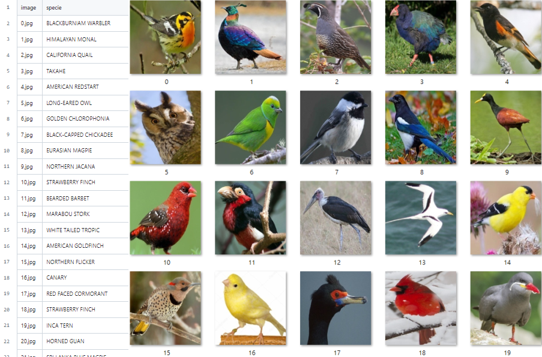

# Adversarial-Attack-for-Bird-species-classification

* This is the classification task with the adversarial attack issue.
## Adversarial Attack Description:
An adversarial example is an input to a machine learning model that is purposely designed to cause a model to make a mistake in its predictions despite resembling a valid input to a human.


* Image is taken from [here](https://towardsdatascience.com/breaking-neural-networks-with-adversarial-attacks-f4290a9a45aa)


## Dependencies
```shell
pip install tensorflow-gpu==2.4.1
pip install keras
```
## Datasets
* In order to prevent the database from being deleted, I first backed it up to my personal cloud space.
[Training set download link](https://drive.google.com/file/d/1HIwHak0hjmaMCP5_m-HAA7FOqsodlX-l/view?usp=sharing)
[Testing set download link](https://drive.google.com/file/d/1puSG_e91lmq2E6lGECV60lFBLKZ2YoKW/view?usp=sharing)
* Images in the dataset are stored in category folders
  

* Found 43622 images belonging to 300 classes inside the training dataset.

|Dataset|train|Valid|Test|
|:--:|:--:|:--:|:--:|
|Image num|43622|1500|3244|
## Code
#### train.py
```shell
  python train.py
```
* Adding the noise on the images to make them look like they have been adversarial attacks.
* Augmentation of the images not only with adding noise but also other common augmentation methods to make the model more robust.
* I use two callback mechanisms, namely, the model only stores the highest Validation Accuracy and when the Validation Accuracy exceeds five epochs and does not improve, the training will be terminated early.
* I chose Adam and SGD for training, and the final experimental results found that the accuracy results of using SGD for training were not as good as using Adam, but it may be that I have not yet found suitable SGD parameters.

#### Inference.py
* Inference the image inside the grading_data and write the prediction result into the CSV file.
```shell
  python inference.py
```


## Experiment Result
* Training Accuracy is 92.74%, and Training Loss is 0.2692.
* Validation Accuracy is 74.53%, Validation Loss is 1.8250.

## Conclusion
Add noise to train on the original image so that the model can identify the test set images that have undergone an adversarial attack. However, there are many methods of adversarial attack, and the model trainer may not necessarily have access to the test set, so it is impossible to know the images of the adversarial attack appearance, So I hope that I can develop a model technology that can face various adversarial attacks in the future.
